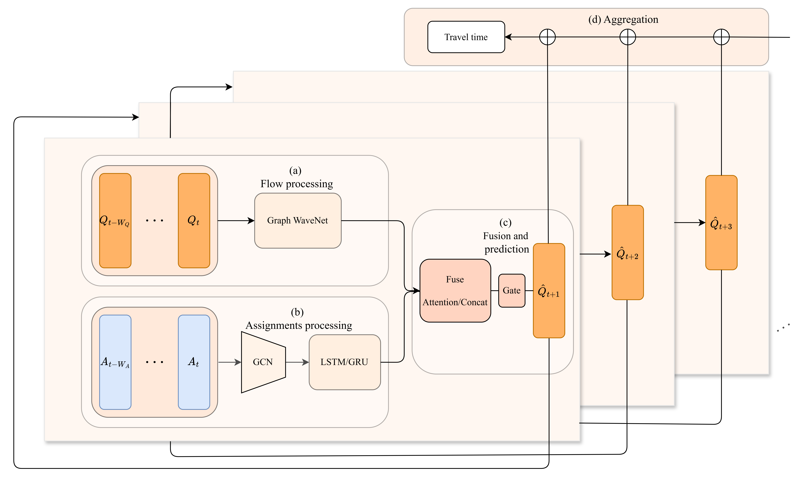

# GenTTP: Generalised Travel Time Predictor

This repository contains the original implementation of **GenTTP**, a model for approximating SUMO-based traffic assignment outputs with machine learning methods.

<p align="center">
  
</p>

The code provides a minimal training pipeline for GenTTP, together with baseline model implementations and example datasets.

## Repository structure

```text
.
├── baselines/
│   ├── AGCRN.py
│   ├── Graph_WaveNet.py
│   └── STAEformer.py
├── datasets/
│   ├── 10_grid/
│   │   ├── new_assignments_10s/
│   │   ├── new_flows_10s/
│   ├── 1k_grid/
│   |   ├── new_assignments_10s/
│   |   └── new_flows_10s/
|   └── adjacency_matrix.csv
├── images/
│   └── GenTTP_Model.png
├── DataLoader.py
├── GenTTP.py
├── Modules.py
├── engine.py
├── train.py
├── utilities.py
├── requirements.txt
└── README.md
```

Main files and directories:

- `train.py` - command-line training entry point.
- `engine.py` - training wrapper and optimization for GenTTP.
- `DataLoader.py` - DataLoader for paired flow and assignment files.
- `utilities.py` - helper functions for data splitting, adjacency loading, metrics, evaluation, seeding, and plots.
- `Modules.py` and `GenTTP.py` - model components and GenTTP architecture code.
- `baselines/` - baseline models implementations: AGCRN, Graph WaveNet and STAEformer.
- `datasets/` - example datasets organized into flow and assignment directories.
- `images/` - figures used by the README.

## Requirements

The project is implemented in Python and uses PyTorch. A recent Python 3 version is recommended.

Install the Python dependencies with:

```bash
pip install -r requirements.txt
```

The actual third-party runtime dependencies are:

- `torch`
- `numpy`
- `pandas`
- `scipy`
- `matplotlib`

## Datasets

Training expects three data inputs:

- a directory with flow files, passed with `--q_dir`;
- a directory with assignment files, passed with `--a_dir`;
- an adjacency matrix CSV, passed with `--adjdata`.

Flow and assignment directories must contain matching `.npy` file names. The dataloader pairs files by name, so each flow file must have a corresponding assignment file with the same file name. The adjacency matrix must match the number of graph nodes specified with `--num_nodes`.

The repository currently contains the following dataset directories:

### `datasets/10_grid`

```text
datasets/10_grid/
├── new_assignments_10s/
├── new_flows_10s/
```

This dataset contains paired assignment and flow files from 10 SUMO simulations generated using grid methods
```bash
--q_dir datasets/10_grid/new_flows_10s \
--a_dir datasets/10_grid/new_assignments_10s \
--adjdata datasets/adjacency_matrix.csv
```

### `datasets/1k_grid_neurips`

```text
datasets/1k_grid_neurips/
├── new_assignments_10s/
└── new_flows_10s/
```

This dataset contains paired assignment and flow files from 1000 SUMO simulations generated using grid methods

```bash
--q_dir datasets/1k_grid_neurips/new_flows_10s \
--a_dir datasets/1k_grid_neurips/new_assignments_10s
```


## Training

Training can be launched directly with `train.py`. Example using the `10_grid` dataset:

```bash
python train.py \
  --device cpu \
  --q_dir datasets/10_grid/new_flows_10s \
  --a_dir datasets/10_grid/new_assignments_10s \
  --adjdata datasets/adjacency_matrix.csv \
  --save_dir ./outputs \
  --exp_name genttp_10_grid \
  --seed 42 \
  --train_ratio 0.7 \
  --val_ratio 0.15 \
  --seq_length_q 15 \
  --seq_length_a 30 \
  --seq_length_y 1 \
  --num_nodes 195 \
  --epochs 100 \
  --batch_size 64 \
  --learning_rate 0.001 \
  --weight_decay 0.0001 \
  --dropout 0.3 \
  --num_workers 4 \
  --sequence_model gru \
  --fuse_method attention \
  --gcn_bool
```

Important training arguments:

- `--q_dir` - path to the directory with flow `.npy` files.
- `--a_dir` - path to the directory with assignment `.npy` files.
- `--adjdata` - path to the adjacency matrix CSV.
- `--num_nodes` - number of graph nodes; must match the adjacency matrix and data tensors.
- `--seq_length_q` - input sequence length for flow data.
- `--seq_length_a` - input sequence length for assignment data.
- `--seq_length_y` - prediction horizon / target sequence length.
- `--sequence_model` - sequence encoder used by GenTTP: `lstm`, `gru`, or `attention`.
- `--fuse_method` - fusion function; `concatenate`, `attention`, `wavenet_only`, or `assignment_only`.
- `--gcn_bool` - enables graph convolution.
- `--addaptadj` - enables adaptive adjacency.
- `--randomadj` - initializes adaptive adjacency randomly instead of using the provided adjacency matrix.

## Outputs

Each training run is saved under:

```text
<save_dir>/<exp_name>/
```

The output directory contains:

- `best_model.pth` - checkpoint selected by the best validation MAE.
- `final_model.pth` - final model checkpoint saved after training and test evaluation.
- `training_metrics.csv` - per-epoch training and validation metrics.
- `learning_curves.png` - plot with training curves.

During training, the script also prints the train, validation, and test metrics to the console.

## Citation

If this repository is useful for your work, please cite the corresponding paper.
